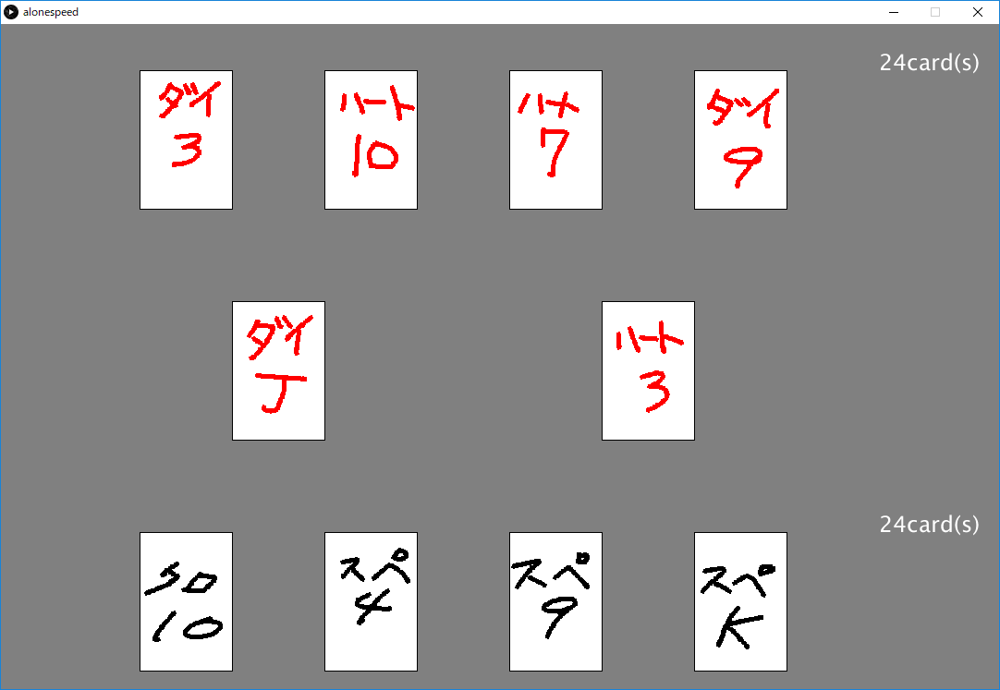

# ひとりでスピード

2人いないとできないスピードをひとりぼっちにもできるようにした

おバカなAIとぼっちスピードをしよう！

## 操作

上下キーで難易度を選択してSpaceかEnterで難易度を決定

Aが一番左の手札を左のカード置き場に置く

Sが二番目に左の手札を左のカード置き場に置く

Dが二番目に右の手札を左のカード置き場に置く

Fが一番右の手札を左のカード置き場に置く

Jが一番左の手札を右のカード置き場に置く

Kが二番目に左の手札を右のカード置き場に置く

Lが二番目に右の手札を右のカード置き場に置く

;が一番右の手札を右のカード置き場に置く

スピード時のASDFは山札があるときは無意味で、山札がない場合に、どのカードを出すかをASDFで決めてるだけ

ゲーム中にEnterを押すとタイトルに戻れる

## その他

開発環境はProcessing 3
